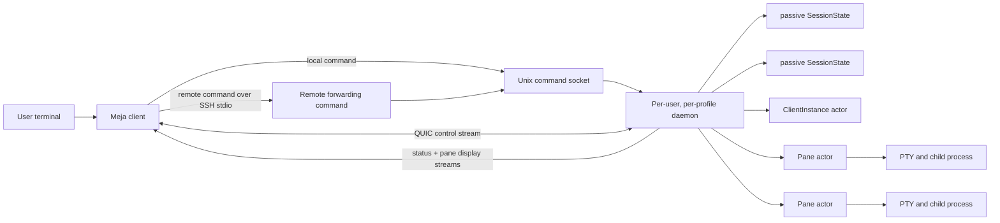
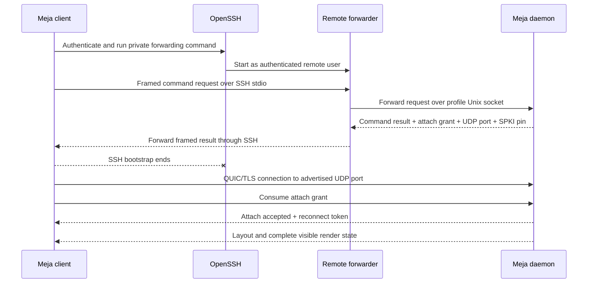
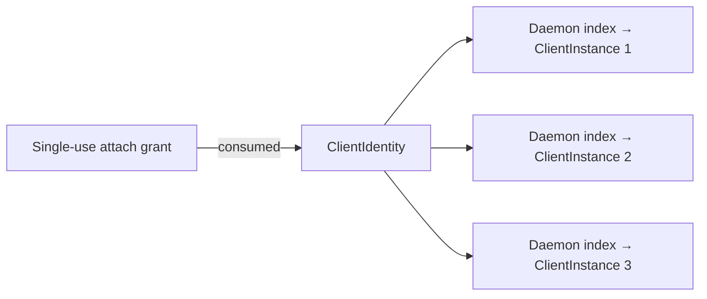
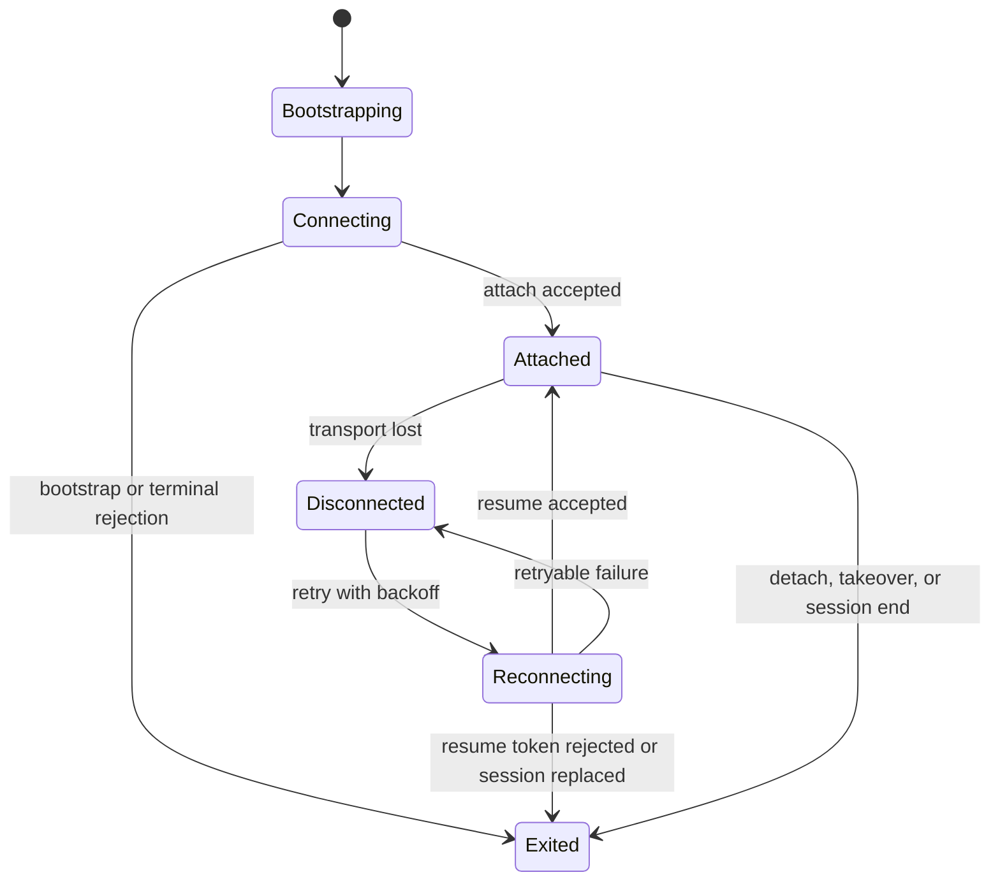
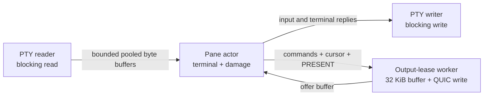
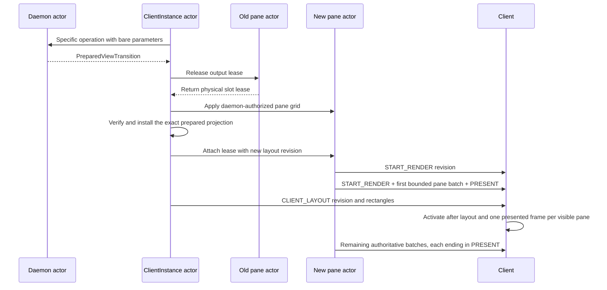
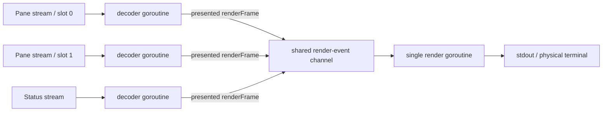
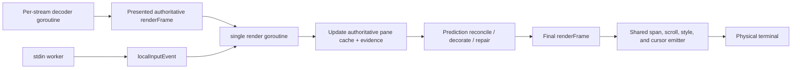

# Meja Architecture

Meja is a terminal multiplexer designed for both local and remote sessions. This document describes the system’s major components, the responsibilities they own, and the boundaries and data flows between the client, server, transport layer, terminal model, renderer, and persistence subsystem.

> **About this document**
>
> This document is maintained primarily with the assistance of large language models. It serves two purposes: to record the authors’ architectural decisions and to provide continuously grounded context for the coding agents that contribute to Meja’s development. Architectural claims should reflect both the implementation and the maintainers’ intent; where they diverge, the code is authoritative.

For an introduction and quick start, see [README.md](README.md). For a comprehensive reference covering commands, options, keybindings, profiles, sockets, autosave, and diagnostics, see [REFERENCE.md](REFERENCE.md).


## Table of Contents

* [Design goals](#design-goals)
* [System overview](#system-overview)
* [Core objects and ownership](#core-objects-and-ownership)
* [The command plane](#the-command-plane)
* [SSH bootstrap and the QUIC data plane](#ssh-bootstrap-and-the-quic-data-plane)
* [Client identity, attachment, and reconnection](#client-identity-attachment-and-reconnection)
* [The actor-owned server](#the-actor-owned-server)
* [Sessions, windows, panes, and PTYs](#sessions-windows-panes-and-ptys)
* [Frontend input and terminal control](#frontend-input-and-terminal-control)
* [The authoritative terminal model](#the-authoritative-terminal-model)
* [Grapheme clusters and cell integrity](#grapheme-clusters-and-cell-integrity)
* [The render protocol](#the-render-protocol)
* [Layouts, render slots, output leases, and relayout](#layouts-render-slots-output-leases-and-relayout)
* [Client rendering](#client-rendering)
* [Latency compensation](#latency-compensation)
* [History and copy mode](#history-and-copy-mode)
* [Snapshots and `.meja` project files](#snapshots-and-meja-project-files)
* [Security model](#security-model)
* [Failure behavior](#failure-behavior)
* [Resource bounds and performance](#resource-bounds-and-performance)
* [Protocol evolution](#protocol-evolution)
* [Code map](#code-map)
* [Testing strategy](#testing-strategy)
* [Architectural invariants](#architectural-invariants)

---

# Design goals

## Sessions outlive clients

A client is a view and controller for a session, not the session itself. The server owns the PTYs, child processes, window tree, terminal state, and history. Detaching, losing the network, or replacing a transport must not terminate those resources.

This is also why reconnecting cannot mean merely resuming a stream of terminal bytes. Output may have continued while no client was reachable. The server must be able to send a coherent current view from its own state.

## One workflow, local or remote

The same command engine creates, attaches to, saves, restores, and manipulates sessions on either machine. Local commands reach a Unix socket directly. Remote commands reach the corresponding Unix socket through a short SSH invocation. Once an interactive attachment has been authorized, local and remote clients use the same QUIC protocol.

## Server authority with responsive input

Remote typing should not need to wait for a full round trip when its visible effect is predictable. At the same time, the client must never become authoritative for application or terminal state. Meja therefore treats prediction as a temporary rendering decoration. Server output confirms or disproves it, and disagreement is always resolved in favor of the server.

## Terminal modes are interpreted on the server

The frontend terminal is an input and output device, not the authority for a pane application's input protocol. The server learns application cursor mode, bracketed paste, focus reporting, mouse tracking, mouse encoding, and Kitty keyboard flags from authoritative pane output. It parses rich frontend events and re-encodes them for the focused pane's current mode. This keeps prefix commands, prompts, history interaction, mouse routing, and application input under one serialized session policy.

## Correct state before clever compression

The server keeps an authoritative terminal grid rather than treating the terminal as a byte sink. That state supports reconnection, resizing, history, incremental rendering, and prediction reconciliation. The wire format is optimized only after the server has established the semantic display units to send.

## Portable recovery, not process checkpointing

Named-session snapshots and `.meja` project files describe how to recreate a workspace: its windows, panes, layout, working directories, shells, and commands. They do not preserve process memory, file descriptors, network connections, or application-internal state. Restoration intentionally creates new processes and a new live session.

## Non-goals

Meja does not attempt to:

* migrate running processes between machines;
* checkpoint arbitrary process memory;
* replay ordinary keystrokes entered while disconnected;
* make SSH the long-lived interactive transport;
* make client prediction authoritative; or
* infer that a restored process is the same process that was saved.

---

# System overview

Meja separates command execution from interactive transport.



The command plane is request/response oriented. It handles operations such as creating a session, listing sessions, saving, restoring, requesting help, and requesting attachment. An attach-capable command returns a short-lived authorization bundle rather than opening the interactive terminal itself.

The interactive data plane is a QUIC connection. It has one framed bidirectional control stream for attachment, reconnection, frontend input, terminal-size changes, layout publication, and server-directed frontend terminal control. A separate status display stream and a bounded pool of pane display streams carry the compact display protocol. SSH is no longer in the path after a remote bootstrap succeeds.

The server is per user and per profile. Each profile has its own command socket, daemon process, session registry, QUIC listener and certificate, session-ID sequence, and private snapshot directory. The default profile is rooted at `~/.meja/default/`; another profile is an independent instance rather than a label inside one global daemon.

---

# Core objects and ownership

The most important architectural question is not which package contains an object, but who may mutate it and how long it lives.

| Object | Lifetime | Authority |
|---|---|---|
| CLI invocation | One command | Parses transport selection and submits one command request |
| Server profile | Until its files are removed | Selects an isolated daemon, session namespace, socket, and snapshot directory |
| Daemon | Server lifetime | Owns session identity, names, attach grants, client identities, identity/session/instance indexes, and the QUIC listener |
| SessionState | Until killed or its final pane exits | Passive per-session view, focus, links, names, and persistence metadata |
| Window | Session lifetime | Owns a layout tree, pane membership, active pane, name, zoom state, and layout revision |
| Pane | Child-process lifetime | Actor-owns a PTY, packed terminal store, parser modes, history, process recipe, pending render damage, and at most one output lease |
| Client identity | Logical-client lifetime | Retains the resume token and allocates `ClientLayoutRevision` across disposable transports |
| Client instance | One live QUIC transport | Owns control/status streams, pane output leases, frontend parser and prompt state, the installed client layout, and connection workers |
| Output lease | One client transport | Owns one render-slot stream, its fixed-capacity render buffer, and the worker that performs blocking stream writes |
| Client pane cache | Current layout lifetime | Stores the last decoded authoritative scanout cells for one visible render slot |

Two distinctions recur throughout the implementation:

1. A session is independent of any client connection.
2. A logical client is independent of any particular QUIC connection.

Those separations are what allow both detachment and reconnection to be ordinary ownership transfers rather than special reconstruction paths.

---

# The command plane

## Invocation routing

The executable first separates transport options from the operational command. Transport selection is local policy: it determines the profile or socket, whether the target is local or remote, and how to reach the remote executable. The remaining arguments are preserved for the server's command engine.

Local commands connect directly to the selected Unix socket. Remote commands are encoded into a framed request and written to a private forwarding command over SSH. The remote forwarding process resolves the remote profile or exact socket, relays the request, and copies the framed result back to the local client.

Command results can contain stdout, stderr, an exit status, and an optional interactive bootstrap. Commands such as `ls` end after the result. Commands such as `new`, `attach`, and `restore` can return a bootstrap and then transition the same client process into interactive mode.

## Unix socket and daemon startup

The command socket is the local authority boundary for a profile. Its containing directory must be private to the user. A server takes an exclusive lock for the selected socket, so two daemons cannot safely claim the same profile. Stale filesystem sockets may be cleaned up, but an active listener is preserved.

Only commands that can sensibly create state start a missing server automatically. Observational or destructive commands do not silently create an empty daemon merely because the requested daemon is absent.

## One command engine

The daemon constructs one immutable `CommandEngine`. Its ordered command registry is the source for lookup, aliases, and server-backed help. CLI commands, prefix bindings, and commands submitted from Meja's command prompt converge on those definitions. The `Ctrl+b, :` editor itself is ClientInstance UI, not a command; after editing it tokenizes the line and submits argv to the engine.

All invocation paths terminate lookup and handler execution in
`CommandEngine.run`. The command-socket adapter supplies a context derived from
the wire request; attached UI supplies a fresh context snapshot from its
ClientInstance. The engine returns an outcome, while the ClientInstance actor
remains responsible for applying any transport-local action in that outcome.

Every handler receives the daemon, an immutable `CommandContext`, and argv. The context contains only normalized caller values: origin (`AttachedUI`, `PaneCLI`, or `StandaloneCLI`), client-instance ID, session ID, pane ID, working directory, and terminal dimensions. It contains no live session, client, or pane pointer. The handler owns its flag and target semantics, then invokes daemon operations with stable IDs and other bare values.

`resolveCommandCallerSession` is the only inference boundary for the caller's
current session. It resolves an attached caller's session ID or a pane CLI's
injected stable session/group target; for a grouped pane, the pane's window
lease selects the exact viewing member. Command handlers resolve explicit
targets directly and use this one function only when their target is omitted.
Standalone callers therefore have no implicit session.

Handlers return stdout, stderr, and at most one typed action. A visible mutation returns exactly one `applyViewTransitionAction`, which contains the complete daemon-prepared transition and therefore needs no separately supplied client ID. Attached execution applies it on the calling ClientInstance actor; command-socket execution routes the same action to the attachment named by the transition. The handler never installs the projection itself.

This single action covers `new-session`, `attach-session`, `restore-session`, `switch-session`, window creation/selection, split, layout cycling, pane swapping, zoom/resize, and pane removal whenever the command affects a live view. A standalone session creation instead returns an attachment bootstrap because there is no existing ClientInstance to update. A mutation of a detached session returns no presentation action. Unzoomed focus is intentionally a control/layout notification rather than a visible replacement.

The CLI adapter frames stdout/stderr and attachment bootstrap data over the command socket. The attached adapter rejects multiline/output-oriented commands instead of inventing a pane-output surface. Confirmation is also an outcome: for example, attached `kill-pane` returns a prompt request whose submit callback captures immutable IDs, revalidates them, commits the daemon operation, and returns the same view-transition action. Prompt behavior is encoded by `PromptMode`; command meaning is not represented by an expanding prompt-kind enum. There is no generic `confirm-before` command.

Commands whose natural result is text, including help, session listing, and
session-save confirmation, return `commandOutcome.Stdout` directly. They have
no presentation action. Their handlers reject attached-UI origin before
performing work; in particular, `save-session` cannot write a file and only
then discover that the caller has no stdout surface.

This reduces three common sources of drift:

* an interactive binding behaving differently from its CLI equivalent;
* validation existing in one entry point but not another; and
* aliases or help text gaining subtly different semantics from canonical command names.

Because help comes from the selected server, local and remote clients describe the command set implemented by the daemon they are actually addressing.

Daemon-wide operations run against daemon-owned state. Live client behavior runs on the ClientInstance actor, and pane behavior runs on Pane actors. The command engine is shared, but ownership remains explicit.

---

# SSH bootstrap and the QUIC data plane

Meja follows the broad bootstrap model established by [Mosh](https://mosh.org/): use SSH for user authentication and initial secret delivery, then leave SSH and run the interactive session over a UDP transport. Meja adapts that model to a persistent multiplexer daemon and to QUIC rather than implementing Mosh's State Synchronization Protocol.

## Remote bootstrap



The system `ssh` executable remains responsible for host verification, user authentication, identities, agents, jump hosts, aliases, and other OpenSSH policy. Meja does not duplicate that authentication machinery.

The bootstrap result binds the next connection to the daemon that answered the authenticated command request. It includes:

* a UDP port in the configured Meja range;
* a short-lived, single-use attach token;
* the token's expiry; and
* the SHA-256 hash of the daemon certificate's Subject Public Key Info.

## TLS binding

The client connects with QUIC and TLS 1.3, then requires the server certificate to match the SPKI hash received through the command plane. The normal public-Web PKI hostname model is not the trust decision here. The SSH-authenticated bootstrap has already supplied the expected daemon public key.

The daemon generates an ephemeral Ed25519 certificate when it starts. Reconnects to that live daemon reuse the pinned key; a daemon restart creates a different key and, independently, has already ended the live PTYs that a reconnect would have resumed.

This creates a direct chain:

```text
SSH-authenticated remote account
    → remote Meja command socket
    → attach grant and certificate pin
    → exact QUIC/TLS daemon instance
```

The attach token authorizes one initial attachment. It is not reused as the long-lived resume token and is not itself the TLS encryption key.

## QUIC stream topology

Each client connection has three classes of streams:

| Stream | Direction | Purpose |
|---|---|---|
| Control | Bidirectional | Attach/resume handshake, frontend input, terminal-size changes, layouts, session switching, and server-directed frontend terminal writes |
| Status output | Server to client | Status bar, prompts, and session/window state |
| Pane render slots | Server to client | Custom display commands for visible panes |

The server pre-establishes one status stream and a bounded set of unidirectional pane render streams. A visible pane receives exclusive use of one pane stream through an output lease. The stream is identified by its connection-local render slot; layout messages on the control stream map that slot to a pane ID and rectangle.

Using an independent QUIC stream for each visible pane matters under load. Ordering and stream-level flow control are isolated, so a pane producing a large or awkward output sequence is less likely to hold up the ordered bytes for another pane. QUIC congestion control and total connection capacity are still shared, so a noisy pane can consume bandwidth; the design reduces cross-pane interference rather than pretending it cannot occur.

The status surface has its own stream because it is not part of any pane's terminal state or geometry. It can update independently and survives pane-slot rebinding.

The control stream is the authoritative lifecycle signal. Output streams carry display data but do not independently decide whether the session was detached, replaced, switched, or terminated.

## Three protocol layers

Meja uses separate encodings for different traffic shapes:

1. The command protocol uses length-delimited structured frames because it is low-frequency, extensible request/response traffic.
2. The interactive control stream uses typed binary frames with bounded payloads.
3. Status and pane display output use a compact opcode grammar with no generic frame wrapper around every operation.

Treating display output separately keeps the hot path small without forcing commands, attachment, or frontend events into a rendering-oriented format.

---

# Client identity, attachment, and reconnection

Meja separates initial authority, logical identity, and live transport.



## Attach grant

An attach-capable command chooses a session through the command plane and asks the daemon for a grant. The grant is random, short-lived, scoped to that session, and consumed once. It connects a previously authenticated command to a new QUIC connection without turning the public UDP listener into a login service.

## Client identity

After the first QUIC attachment succeeds, the daemon creates a `ClientIdentity` and returns its resume token to the client. The identity contains only that token and the daemon-owned monotonic `ClientLayoutRevision` allocator. Daemon indexes separately relate the identity to its assigned session, current disposable `ClientInstance`, terminal rejection reason, and reverse session attachment. Transport lifecycle therefore does not mutate an identity into a container for live runtime state.

The reconnect token is stable across retries. Reconnection does not mint a chain of successor identities that could race with one another.

## Client instance

A `ClientInstance` is the daemon-side object for one live QUIC connection. It owns the control stream, status stream, pane output leases, frontend input parser, its last successfully published `currentLayout`, held-key and pointer capture state, and connection-local workers. The pane/slot mappings used for output handoff are derived from `currentLayout.Panes`; the client does not retain a second binding snapshot. This transport-local state is intentionally disposable.

There is no separate `ClientState` view model. Prefix, prompt, resize-repeat,
and directional-focus parser fields live in a private `clientInputState` value
inside the instance; terminal dimensions live in the transport atomics; and
the installed window, focus, geometry, slots, and revision live only in
`currentLayout`.

When a client reconnects, the daemon resolves the token to the existing identity, uses its daemon-owned session assignment, creates a new instance, marks the previous instance stale in the live-instance index, and closes or ignores the old transport. Session processes and terminal state do not move; only the borrowed transport resources and frontend parser state are recreated. The new instance begins without a current view. The daemon prepares a mandatory full reconnect projection by allocating a `ClientLayoutRevision` newer than every projection prepared for that identity.

Attach and detach are daemon-coordinated lifecycle operations. The daemon validates and updates identity, session, live-instance, active-client, and window-lease ownership before asking the `ClientInstance` to initialize or release transport-local frontend resources. Client-side initialization and cleanup never register, replace, or unregister a daemon-owned client relationship.

## One-to-one assignment

The daemon enforces two sides of the attachment relationship:

* one logical client is assigned to at most one session; and
* one session is controlled by at most one logical client.

A live session switch moves the same logical client, QUIC connection, streams, leases, and identity assignment to another session. A second client attaching to an occupied session displaces the first. These are terminal ownership changes, not retryable network failures, so the displaced client exits instead of reconnecting forever.

## Reconnection lifecycle



On transport loss, the client:

1. removes the live control destination;
2. retains the last authoritative screen;
3. shows the reconnecting state and last-contact time;
4. deliberately drops ordinary input while disconnected;
5. runs the attachment's registered frontend-terminal exit command;
6. lets `Ctrl+C` act as a local way to leave; and
7. retries with bounded exponential backoff.

Dropping disconnected input is a correctness choice. Buffering and later replaying keystrokes would apply them to an application state the user could not observe. Reconnection restores visibility first.

On resume, the server installs a fresh frontend-terminal setup, rebinds the new connection's output leases, reapplies the current terminal size, publishes the layout, and starts a complete visible refresh for every pane. A refresh may arrive as several presented batches. The client does not depend on recovering the precise sequence of render bytes missed during the outage.

---

# The actor-owned server

Meja's server separates passive graph state from live actors. The daemon is the
single executor for registry, group, window, lease, command, and lifecycle
transactions. ClientInstance actors own connection-scoped behavior, and Pane
actors own PTYs and terminal state. Other goroutines communicate through
bounded channels and immutable or copied messages.

We use “lock-free architecture” here in the ownership sense, not as a formal non-blocking progress guarantee. Core mutable domain state is not shared behind a large graph of mutexes. There are still narrow mutexes and atomics for infrastructure concerns such as logging, listener lifecycle, shutdown flags, and read-mostly pane metadata. Those do not replace actor ownership of sessions, layouts, terminal grids, or render leases.

## Daemon actor

The daemon actor owns server-wide coordination:

* the numeric session registry;
* the session-name registry;
* attach grants;
* client identities and their assignment/live-instance indexes;
* logical-client-to-session assignments; and
* the active attachment for each session.

Requests contain a closure and, when needed, a completion channel. Code that
needs a result submits one short daemon transaction. Code that only needs to
continue a protocol submits a one-way post. The daemon never waits for client
output, pane termination, process observation, prompts, or filesystem I/O.

The QUIC accept loop and command-socket handlers can run concurrently because they do not mutate the registries directly. They ask the daemon actor to perform the mutation.

## Session and group ownership

The daemon actor owns the authoritative execution graph:

* `GroupState` membership;
* canonical `WindowState` objects and synchronized `WindowLink` records;
* canonical pane membership and daemon-global IDs;
* `WindowViewLease` acquisition, release, and generation checks; and
* grouped add/remove, fallback, process-target, and persistence-snapshot changes.

It also owns pane lifecycle. Pane IDs are allocated by the daemon; pane creation, PTY/process startup, graph insertion, runtime goroutines, process observation, termination, and rollback are daemon operations. A ClientInstance receives pane identities and layout through a projection plan, never by constructing or starting a Pane.

`SessionState` is passive. It contains the per-session view and durable model
data but no mailbox, coordinator, or live-client authority. `GroupState` also
has no mutex: relationship mutations are serialized by the daemon actor.

The live `ClientInstance` owns one QUIC connection, ordered control frames,
frontend decoding, prefix and prompt editing, terminal dimensions, one
installed client layout, output handoff, and stream writes. Pane identities,
slots, and rectangles are read from that layout rather than retained in
parallel binding state. It consults the daemon by short transactions and never
becomes the registry authority.

Every session has exactly one group, including an ordinary singleton session.
Every window belongs to exactly one group, and every grouped session has a
separate link to the same canonical window object. A grouped new session copies
view metadata and links; it never copies a pane, PTY, process, or execution
graph.

Each attached client owns exactly one `WindowViewLease`. A live window has at
most one lease, so a pane has at most one viewer while retaining its existing
single output-lease design. Lease acquisition checks the target before changing
active/previous-window state and uses acquire-before-release semantics. A
rejected target leaves the old lease, active/previous view, focus, bindings, and
visible output untouched.

Window selection, attach/resume, grouped window destruction, and fallback are
single daemon transactions. Client projection plans include attachment ID,
session ID, window ID, lease generation, projection/layout revision, and
dimensions. The client validates these identities before changing output
bindings or routing input.

No Session coordinator remains. A command mutates passive model
state in a daemon transaction, then sends an immutable projection or event to
the relevant ClientInstance. Pane exit events use daemon-global pane IDs and
are reconciled by the daemon before any client refresh is posted.

### Projection plans

Visible replacement is one three-step transition rather than a generic intent
interpreter. First, the operation entry point calls the specific daemon method
with its real parameters: for example `windowID`, `paneID`, split direction,
target session, or terminal columns and rows. For a command, that entry point
is its registered handler; for transport events it is the ClientInstance
actor. The daemon method owns the operation-specific validation and graph
mutation. There is no delayed callback, tagged union, or caller-selected
handoff policy.

Second, every successful visible-replacement operation converges on
`prepareViewTransitionNow`. Inside the same daemon transaction it allocates
the client identity's next `ClientLayoutRevision` and returns one immutable
`PreparedViewTransition` containing the `ClientProjectionPlan`, exact
daemon-authorized pane grids still to apply, and handles for removed panes that
may still own this client's output leases. The daemon updates canonical target
geometry but does not resize an attached pane actor while its old output grid
is live.

Third, the caller routes that prepared value to the affected ClientInstance;
`ClientInstance.applyViewTransition` validates freshness, reclaims all
installed output leases, applies the prepared pane grids, resolves and verifies
the exact pane output destinations, commits transport-local client state, reattaches the
leases, publishes status, and sends the exact prepared `CLIENT_LAYOUT`. It does
not call operation-specific logic or walk mutable session/window state to
invent another answer.

A plan carries the attachment and session identity, window lease generation,
logical projection revision, one complete `ClientLayout`, and whether a full
snapshot is required. Terminal dimensions remain transport state and are used
while preparing pane rectangles and resize work; they are not copied into the
plan. Status remains an independent stream
and is not duplicated inside the projection. `ClientLayout` is the single
representation of window identity, client layout revision, focused pane, pane
rectangles, and render slots; the plan does not carry parallel pane and binding
slices. The client rejects an
older attachment, lease generation, or projection revision before releasing
any output binding. `WindowLayoutRevision` is a distinct daemon-only type and
never enters a client projection. The client identity owns
`ClientLayoutRevision`; a full transition reserves its next value before
crossing the actor boundary, and `ClientInstance.applyViewTransition` publishes
that value unchanged in `CLIENT_LAYOUT` and `START_RENDER`. This forces one
coherent cache-replacing activation even when canonical window geometry did
not change.

Window creation and selection, split and layout changes, terminal resize,
pane close/exit, attach, and session switching all converge on this pipeline.
A session move commits daemon assignment and lease transfer during preparation,
but changes the ClientInstance's installed session only during application.
The application phase accepts an empty client-local starting view as long as
the transition carries the daemon-authorized assignment. There is no second
session-specific activation action and no error value used as control flow.
A focus change in an unzoomed layout is deliberately not a visible replacement:
it updates cursor ownership through the control stream without releasing pane
outputs or resizing panes. It reuses the current `ClientLayoutRevision`; the
frontend accepts that equal revision only when window identity, pane IDs,
slots, and rectangles are unchanged. A zoomed focus change does alter visible
geometry and therefore uses a full transition with a newer revision.

New-window activation, session switching, selection, attach/resume, and
involuntary pane-exit fallback all produce the same transition type. The daemon
never waits for output handoff, stream writes, or snapshot rendering. Pane exit
is resolved by `PaneID -> WindowID -> GroupID`, reconciled once, and posts a
normal `PreparedViewTransition` to each affected ClientInstance; it has no
special projection installer. If no viewable fallback exists, the transition
requests a clean client close rather than leaving stale bindings.

The model has no `GroupState` mutex and no session-wide model mutex. The
daemon request loop is the serialization mechanism; atomics are used only for
immutable publication/revision or infrastructure flags, not to turn shared
graph mutation into a second ownership system.

## Pane actor

The actor model continues down to each pane. A pane's main goroutine exclusively owns:

* mutation of the terminal emulator and its packed row store;
* publication of application cursor, paste, focus, mouse, and Kitty keyboard modes;
* aggregation of terminal damage;
* the current output lease;
* progress through damage that spans multiple presented batches;
* live versus history view rendering and selection state;
* output attachment, release, and refresh; and
* PTY resize as coordinated with terminal resize.

The main loop selects among PTY-output buffers, pane commands, render-buffer availability, output failures, batching timers, and shutdown. It never blocks on a PTY read or a QUIC write. There is no pane-side render mutex: terminal mutation, damage merging, resize, capture, history state, and render compilation all happen as turns of this one actor.

Separate narrow workers read the PTY, write the PTY, and wait for the process. The reader may block in `PTY.Read`, but it only owns raw pooled byte buffers and transfers them through a bounded channel. The writer may block while delivering user input or terminal-generated replies. Neither worker concurrently mutates the terminal grid. Keeping the blocking read outside the actor is essential: an idle child must not prevent attach, resize, capture, a returned render buffer, or shutdown from being processed.

Each output lease has another narrow worker for its physical QUIC stream. That worker owns a single fixed-capacity render buffer whenever it is writing or idle. It offers the buffer to the pane actor, waits for the actor to return one complete `PRESENT`-terminated batch, performs the potentially blocking stream write, clears the buffer, and offers it again. While the worker is blocked, the pane actor remains free to parse PTY output and merge newer damage. At most one side owns the buffer at any instant.



The output lease is physically returned by the pane actor before the ClientInstance binds it to another pane. If its worker is still writing the final old-pane batch, the newly selected pane cannot borrow the buffer until that ordered write completes. This makes stream rebinding observable and ordered rather than relying on a shared pointer swap.

`capture-pane` is also submitted as a pane command. The actor formats the requested visible rows or history directly from the authoritative store while no PTY chunk, resize, or render compilation can mutate it. PTY reads can accumulate in the bounded input channel during that turn, but queued bytes are not part of the capture until the actor applies them. This produces a consistent actor-boundary capture without a terminal-grid mutex; a very large capture can temporarily delay that pane's actor.

## Client and status ownership

Status output is part of the ClientInstance actor. The daemon supplies the
current passive status model; the client owns status encoding, stream writes,
prompts, and full refresh after replacement. Attaching or switching a client
changes daemon assignment first, then the ClientInstance performs its output
handoff without making the daemon wait for stream I/O.

## Avoiding actor deadlocks

Actor ownership is only useful if actors do not form wait cycles. Cross-owner
operations therefore follow `ClientInstance -> Daemon.call`, `ClientInstance
-> Pane`, `Pane/process -> Daemon.post`, and `Daemon -> ClientInstance.post`.
Session rename and command prompts use typed client events; the daemon reserves
the name or performs the mutation and posts the result without waiting for
client output. Slow process observation and persistence writes happen outside
the daemon transaction and return only immutable/advisory results.

---

# Sessions, windows, panes, and PTYs

## Session and group state

A group is the authority for one shared execution graph. It owns canonical
windows, panes, layouts, dimensions, and daemon-global IDs. A session is the
external view of that graph: active and previous window, focused pane, prompt,
and status state belong to the session rather than the physical terminal.

The final pane exiting ends the session. A network connection ending does not.

## Grouped persistence

Named recovery records use schema 2 metadata in the existing session file
location. The record identifies the shared graph with a stable group ID and
stores the session's active/previous windows plus independent focus and zoom
views. Version-1 records have no group identity and restore as singleton
groups. Runtime leases, ClientInstances, output bindings, transports, and
terminal contents never enter a snapshot.

The daemon supplies immutable persistence snapshots to the persistence worker;
encoding, filesystem writes, and obsolete-file removal happen outside the
daemon actor. If a session view with an already-live group ID is restored, the
daemon attaches that view to the existing canonical graph and starts no new
pane or process. A reconnect or restore therefore cannot duplicate the shared
execution graph.

## Window layout trees

A window layout is a binary tree:

* a leaf refers to one pane;
* an internal node splits a rectangle vertically or horizontally;
* a fixed-point ratio divides the usable dimension between the children; and
* one cell between children belongs to the border.

Computing the tree projects it into pane rectangles in visual order. Removing a pane collapses its immediate parent while preserving the rest of the tree. Resizing adjusts the nearest eligible boundary in the requested screen direction and clamps the result so descendants retain their minimum size.

Preset layouts rebuild a tree from the current panes. Zoom is a projection of the focused pane into the window rectangle; it does not destroy the stored tree, so unzooming restores the previous arrangement.

## Pane process model

Each pane starts a child process on a fresh PTY. An empty requested command starts the user's shell; an explicit command is resolved and launched through the same pane recipe. The pane records immutable launch metadata separately from later process observation.

PTY output is read into pooled buffers and sent to the pane actor. Terminal-generated replies, such as device-status responses, travel back through the pane's owned input channel. User input follows the same PTY writer after session-level prefix, prompt, history, and application-cursor handling.

### Live process and command monitoring

Meja tracks the command associated with a pane by observing operating-system process state. It does not require shell integration, inject prompt hooks, parse shell history, or infer commands from terminal text. The result is advisory metadata used for automatic window names and restart recipes; the pane's PTY and child process remain the runtime authority.

When a pane starts, the daemon-wide `ProcessMonitor` registers one `Anchor` for
the daemon-global `PaneID`. The anchor contains the pane root's process
identity, the PTY, and whether the root was launched as an interactive shell.
The monitor's delivery session may change when a grouped session exits, but the
pane watch and its identity do not. Process identity is `(PID, birth token)`
rather than PID alone, so a later process that reuses the same numeric PID
cannot be mistaken for the pane root.

The monitor is a single actor with a bounded command mailbox and one watch per live pane. Pane I/O producers send it activity edges rather than observations:

* any PTY output indicates that the foreground job may have changed;
* input that can cross a job-control boundary—Enter, interrupt, EOF, suspend, or quit—does the same; and
* an atomic `processActivityPending` edge allows at most one queued activity notification per pane until the monitor consumes it.

Activity delivery is deliberately nonblocking. A busy pane must never stall PTY reads or user input because process bookkeeping is slow or the monitor mailbox is full. If the activity edge cannot be queued, the producer clears it and later activity may try again.

The monitor uses a two-tier observation strategy. After a short settling delay, and no more frequently than the configured minimum interval, it first asks the PTY for its current foreground process group with `TIOCGPGRP`. When that process-group ID still matches the watch fingerprint, no process-table walk is needed. A changed foreground group, a failed probe, an uninitialized watch, a scheduled confirmation, or periodic reconciliation triggers a deep observation.

Deep observations are batched across all panes that are due, under a bounded timeout. On Linux, one pair of `/proc` scans serves the whole batch. For each anchor, the observer verifies before and after that:

* the root still has the same PID and birth token;
* the root still belongs to the expected session and TTY;
* the PTY's foreground process group did not change during the observation; and
* the membership and identities of the foreground process group remained stable.

It then reads structured `argv`, executable, and working-directory data for the root and foreground group. If the process table changes during capture, the observation is retried and can ultimately be classified as unstable rather than accepted. Platforms without procfs use a portable `ps` fallback with before/after snapshots and an immediate-child model; that path intentionally reports less structured command and directory information.

Classification depends on how the pane was launched. For an explicitly requested command, the pane root itself is the candidate. For an interactive shell, exactly one direct child in the stable foreground group is treated as the meaningful command. No foreground child while the shell owns the PTY is `shell-owned`; multiple plausible children, or a foreground group that cannot be related cleanly to the shell, is `ambiguous`. This avoids claiming a precise restart command when job-control state does not support one.

Each accepted observation is reduced to a fingerprint containing the foreground group, classification, root directory, candidate identity and command, candidate directory, and derived window name. A newly detected command schedules a trailing stability confirmation rather than becoming durable immediately. Activity also schedules a trailing probe, and a periodic full reconciliation repairs missed activity edges or changes that produced no terminal output. The current implementation batches the initial watch after 10 milliseconds, settles activity for 250 milliseconds, limits activity probes to one per 500 milliseconds, confirms transitions after another 500 milliseconds, reconciles every 30 seconds, and bounds each deep observation to one second. These are tuning constants rather than persistence-format or protocol guarantees.

Results are grouped by daemon-global pane identity and posted to the daemon using the session ID captured in the watch. The monitor does not retain a SessionState pointer or mutate canonical state directly. Before applying a result, the daemon revalidates the pane ID, root identity, PTY, and surviving group target. Stale observations for removed or replaced panes are ignored.

For persistence, the session projects a valid observation into a candidate working directory and restart command. The same projection normally has to be observed twice before it replaces the saved recipe; returning to the pane-owned shell is accepted in one sample. Explicitly launched commands continue to use their immutable launch recipe. Short-lived commands such as `ls`, `clear`, and `meja` do not replace the previous useful command. Ambiguous, unstable, or unavailable observations likewise do not overwrite a known-good recipe.

Automatic window naming consumes the same observations but remains a separate projection. Only automatically named windows are updated, and transient or uncertain candidates are ignored. This separation lets command monitoring improve presentation and recovery without turning a best-effort OS observation into authoritative pane state.

---

# Frontend input and terminal control

The physical terminal sends byte sequences, but the active pane may expect any of several keyboard, mouse, paste, and focus protocols. Passing those bytes blindly would make Meja's own prefix handling and pane-aware routing depend on whichever modes happen to be active in the frontend terminal. Instead, Meja places a semantic routing layer on the server.

## Attachment-scoped frontend capture

After attach or resume succeeds, the server sends two control messages before ordinary rendering begins:

1. a terminal exit command that the client registers for cleanup; and
2. a terminal setup write that enables the attachment's input-capture modes.

The current setup requests Kitty keyboard event reporting, SGR mouse coordinates and motion, focus events, and bracketed paste. The client serializes these terminal writes through the same UI loop that owns rendering. On disconnect, failed attachment, or normal shutdown, it executes the registered exit command and then applies its fixed raw-mode and alternate-screen cleanup. Both paths explicitly reset the frontend capture modes instead of depending on xterm-private saved-mode restoration.

Keeping setup server-driven lets a protocol-compatible server define the frontend capabilities required by its input router while keeping cleanup paired with the exact setup that was installed.

## Bounded frontend parser

The client sends frontend bytes on the control stream together with the layout revision currently visible on screen. A bounded incremental parser in the `ClientInstance` turns fragmented input into semantic events:

* key press, repeat, and release events, including legacy and Kitty encodings;
* bracketed paste start and payload;
* focus in and focus out; and
* SGR pointer press, release, motion, and wheel events.

A trailing Escape is held for 25 milliseconds at the client's local TTY boundary so it can be distinguished from the prefix of an Alt or control sequence without making QUIC latency part of input semantics. More local bytes cancel the delay and are sent with the Escape. If the source stays idle, the client sends the Escape with an explicit `SourceIdle` flag; only that flag lets the server resolve its pending lone Escape. Outside bracketed paste, every new Escape starts a fresh input transaction and abandons any incomplete sequence. Sequence and paste buffers are bounded; unknown, malformed, or oversized control input is discarded through its final byte rather than retained or reinterpreted as pane text.

## Server-side routing and re-encoding

The ClientInstance actor decides whether an event belongs to Meja or to a pane application. Prefix commands, prompts, history interaction, and session switching stay on the command path. Ordinary pane input is re-encoded from the semantic event according to the pane's authoritative terminal metadata:

* normal versus application cursor keys;
* bracketed paste;
* focus reporting;
* classic or SGR mouse encoding and the requested tracking level; and
* supported Kitty keyboard flags, including event types.

Plain printable input has a fast path that preserves batching when no escape sequence or Meja command boundary is involved.

## Layout-aware pointer routing

Pointer input is tagged with the layout revision the user was viewing. The `ClientInstance` hit-tests only when that revision equals `currentLayout.LayoutRevision`. Input for an older or unknown revision is dropped instead of being interpreted against either historical or current geometry. This deliberately prefers an occasional missed click during a layout race over retaining old projections or risking delivery to the wrong pane.

A press can focus a pane. Drag and release remain captured by the pane where the gesture began even if the pointer crosses a border. When the application has enabled mouse tracking, Meja translates the event to pane-relative coordinates and forwards it using the application's selected mouse encoding. Otherwise, wheel events navigate history or become cursor-key input, and a primary-button drag belongs to Meja's selection behavior.

This gives input a strict geometry contract analogous to the render relayout contract: a pointer event is interpreted only when the server and frontend name the same current coordinate space.

---

# The authoritative terminal model

The server parses PTY output into terminal state even while no client is attached. It does not delegate terminal interpretation to the user's terminal emulator and hope to reconstruct state later.

The model includes:

* primary and alternate grids;
* cursor position, visibility, and saved cursor state;
* styles and colors;
* scroll regions;
* autowrap, insert, origin, and application-cursor modes;
* bracketed paste and focus reporting;
* mouse tracking level and mouse encoding;
* supported Kitty keyboard flags and their stack;
* tab stops and character-set selection;
* soft-wrap relationships used during resize; and
* bounded primary-screen history.

Parsing is incremental. UTF-8 and control sequences may be split at any PTY read boundary. Incomplete sequences stay in bounded parser state until completed, cancelled, or discarded. Unknown or unsupported controls must not allow parser buffers to grow without limit.

## Packed cells and bounded rows

The terminal grid is optimized around the observation that most cells need only three pieces of information: what kind of display unit they are, a small value or indirection, and a style. Meja stores those fields in one pane-local 32-bit `cellWord` rather than putting a Go string and a full style object in every column.

### The 32-bit `cellWord`

The current in-memory layout is:

```text
 31            28 27                         12 11                  0
+----------------+------------------------------+--------------------+
| kind: 4 bits   | payload: 16 bits             | style ID: 12 bits  |
+----------------+------------------------------+--------------------+
```

This is a logical bit layout inside a `uint32`; `cellWord` values are not copied directly onto the wire, so host byte order is not part of the protocol.

The low 12 bits select one of at most 4,096 pane-local styles. The middle 16 bits hold either the low bits of a Unicode scalar or the low bits of a cluster handle. The high four bits describe how to interpret the payload and whether the anchor occupies one or two terminal columns.

The order is deliberate. Keeping `kind` in the high bits allows it to be read with a shift and no mask; keeping the style ID in the low bits makes style application a simple OR and lets a styled blank be represented by its style bits alone. The payload occupies the middle, where extracting its `uint16` value requires a shift but no separate mask. Other field orders can make the payload low or half-word aligned, but they add masking or shifting to the more frequently used kind or style operations.

The defined kinds distinguish:

* a styled blank;
* a zero-width continuation cell;
* narrow and wide directly packed scalars, with four scalar windows carrying the scalar's upper bits; and
* narrow and wide cluster handles, with separate kinds carrying the seventeenth handle bit.

A directly packed scalar may use up to 18 bits: the 16-bit payload plus a two-bit scalar window encoded in the kind. This covers the common terminal repertoire without an allocation. A scalar or grapheme that cannot use the direct form is stored through the cluster table instead. The remaining kind values are currently unused, leaving room for another pane-local representation without changing the word width.

The blank form is especially cheap: kind and payload are zero, so a styled blank is represented by its style bits alone. A wide display unit is an anchor with a wide kind followed by an explicit continuation word. The continuation carries no independent text and reports width zero; it exists so overwrite, insertion, deletion, resize, and cache repair can detect the second half of a wide unit without searching a separate side table.

The packed word is deliberately an internal storage format. Operations that cross an actor or protocol boundary first resolve it into semantic text, width, and style. No client is expected to understand `cellKind`, cluster handles, or pane-local style-table layout.

### Pane-local style storage

Styles are interned once per terminal state rather than repeated in every cell. `styleByID` is the dense ID-to-style table used by rendering, while `styleToID` deduplicates newly encountered SGR combinations. ID zero is permanently the canonical default style. `nextStyleID` makes allocation append-only, and a cached `(style, ID)` pair avoids a map lookup when the parser's current style has not changed.

The 4,096-entry limit is not arbitrary: it is the exact capacity of the 12-bit style field. Existing IDs stay stable while cells, the alternate screen, history snapshots, or pending renders may still refer to them. The implementation therefore does not compact or recycle style IDs during a pane's lifetime. Resize clones the tables so reflowed cells retain the same IDs. History snapshots copy the definitions they need so selection and frozen rendering resolve styles independently of later parser activity.

We consider 4,096 styles an acceptable compromise for keeping every backing cell four bytes. If real workloads need an escape hatch, the design leaves room for a coordinated style-generation reset: rebuild or remap the pane's live cells into a fresh pane-local style table whose allocation index starts again at zero, reset or rebind the pane's render-stream generation, and reinstall only the styles still needed by a forced full render. Stream-local style installation is already disposable across a relayout or replacement attachment; the missing part is the coordinated pane-table remap. We have not implemented or exercised that reset path yet, so it should be treated as an available design option rather than current behavior.

If a pane encounters more distinct styles than the table can represent today, the current bounded failure mode is to stop allocating a new ID; unseen styles then degrade to style ID zero rather than making cell storage unbounded. That behavior is an implementation limit, not a desirable terminal semantic, and is worth preserving in tests if the allocation policy changes.

### The cluster store

Text that is not profitable or possible to encode directly is interned in a pane-local `clusterStore`. Each live entry contains the complete UTF-8 string and a reference count. A reverse `byText` map deduplicates equal strings, while a free-handle stack lets dead slots be reused without changing handles still referenced by cells.

Cluster handles are 17 bits wide. Sixteen bits live in the payload and the high handle bit is represented by the low/high cluster kind, allowing at most 131,072 live handle slots. Only anchor cells hold a handle; continuation cells do not add a reference. Replacing an anchor, evicting a row, discarding history, resetting a screen, or destroying a snapshot releases its reference. Copying a row store for history increments references for every cluster-bearing anchor in the copy.

This reference accounting is what lets primary rows, a saved primary screen while the alternate screen is active, and frozen history snapshots share cluster text safely without copying every string. When the final reference disappears, the reverse-map entry is removed, the text is cleared, and the handle is returned to the free list.

If the bounded cluster table cannot accept another string, the current fallback stores a replacement character with the requested cell width. The store therefore has a deterministic memory ceiling and a visible degradation mode rather than an unbounded allocation path.

### `rowBlock` and circular row addressing

Primary-screen history and the visible viewport are one logical sequence in `rowStore`. The current store has a capacity of 2,048 rows, represented by a fixed array of 16 `rowBlock` values. Each block covers 128 physical row slots and is allocated lazily as one contiguous `128 × cols` cell slice. Its two 64-bit words hold one soft-wrap bit for each row in the block.

```text
rowStore
  head  ── logical row 0 / oldest retained row
  count ── number of retained rows
  blocks[0..15]
      cells: 128 * cols packed cellWords, allocated on demand
      wraps: 128 soft-wrap flags
```

`head` and `count` are enough to map a logical row to a physical slot. Because the capacity is a power of two, wrapping uses a mask rather than a remainder operation. Visible row zero is `count - viewportRows` rows after the logical head; older logical rows are history.

Appending a full-screen primary row has two cases. Before capacity is reached, the store materializes the destination block if needed and increments `count`. At capacity, it reuses the slot at `head` and advances `head`, making the next row the oldest. Before reuse, every cluster handle in the evicted row is released; the row is then filled with one styled blank word and its wrap flag is cleared.

Blocks are width-specific. A terminal resize does not attempt to reinterpret an allocated `128 × oldCols` slab as a different width. The terminal builds a new store, reconstructs logical soft-wrapped lines from the old sequence, reflows complete cell units at the new width, retains only the newest rows that fit the capacity, and then releases the old storage. This keeps row indexing simple in the hot path and moves width conversion into the already-expensive resize path.

Cloning a `rowStore` copies only allocated blocks and wrap bitsets, then retains every referenced cluster handle. Releasing a store walks its logical rows and releases those handles before dropping the blocks. The row container therefore owns the references represented by its cell words, which makes history snapshot lifetime explicit rather than relying on garbage collection of detached strings.

The packed representation is an implementation optimization, not a change to terminal semantics. Rendering, history snapshots, resize, selection, and persistence projections resolve cells back into complete display units before exposing them outside the pane actor.

## Damage rather than repeated snapshots

Applying PTY bytes produces an `Update` describing visible consequences:

* one dirty column span for each affected visible row;
* a scroll delta;
* cursor or visibility changes;
* terminal replies; and
* a full-redraw marker for transformations that cannot be expressed safely as local damage.

The pane actor merges updates into persistent per-row dirty spans. A brief idle period makes newly accumulated work eligible for rendering quickly; a maximum batch age prevents a continuous stream from postponing it forever. Damage coordinates are client-relative visible rows, even though the underlying row store also contains history. Detached panes parse without tracking render damage because their authoritative grid is sufficient for the next full refresh.

Eligibility and buffer availability are separate. Once damage is due, the actor borrows the lease's buffer when the output worker offers it and encodes as much current grid state as fits. A successfully encoded prefix advances that row's dirty-span start; a complete span is cleared. A span that does not fit is left unchanged, and an encoded prefix leaves its suffix dirty. New PTY damage is unioned with any retained suffix, so later batches render the newest authoritative cells rather than an old cell snapshot. Scroll during a progressive multi-batch update promotes the work to a full redraw when shifting retained coordinates would be ambiguous.

This separates terminal correctness from transport frequency. The parser can consume arbitrary chunks, while the renderer chooses a useful presentation cadence.

---

# Grapheme clusters and cell integrity

Terminal cells are columns, but user-visible characters are not necessarily Unicode scalar values. A visible unit may contain a base character, combining marks, variation selectors, emoji modifiers, zero-width joiners, or script-specific joining behavior. Treating each rune as an independently writable cell produces broken display, cursor, overwrite, and resize behavior.

Meja represents a complete grapheme cluster on an anchor cell:

```text
width 1 cluster: [ anchor ]
width 2 cluster: [ anchor ][ continuation ]
```

Semantically, the anchor resolves to the complete UTF-8 cluster, a style ID, and a display width. Physically, a simple scalar may be packed directly into the anchor's `cellWord`; a complex cluster is held once in the pane-local cluster store and referenced by a refcounted handle. The continuation has width zero and no independent text. A styled blank is distinct: it has no text but width one.

This representation gives the server a canonical answer to several difficult cases:

* appending a combining mark extends an eligible anchor rather than consuming a new column;
* promoting a cluster from width one to width two repairs the adjacent cell;
* overwriting either half of a wide cluster repairs the entire old cluster;
* wrapping never splits an anchor from its continuation;
* history snapshots retain complete display units and cluster references;
* shrink and reflow preserve cluster boundaries; and
* the client receives the server-decided width instead of remeasuring text with a potentially different Unicode table.

The wire protocol includes a dedicated opaque cluster operation. Its contract is intentionally stronger than “write this UTF-8 text”: the payload is one already-segmented display unit with an established cell width. The client may place it, cache it, and repaint it, but must not split it into runes or reinterpret its width.

Fast paths remain available for ordinary width-one text and directly packed scalar cells. Grapheme correctness is not a requirement that every ASCII run pay the most general representation cost.

The central invariant is:

> A cluster is either represented atomically or repaired into a valid set of cells before it becomes externally visible.

---

# The render protocol

The render protocol is a compact state machine for transforming a pane-sized display surface. It is not a stream of PTY bytes and not a serialization of the entire terminal object.

## Display command set

Display streams use an opcode grammar rather than the generic control-frame envelope. Each command begins with one byte and is followed only by the fields that command needs. Coordinates and IDs use variable-length integers; text uses a bounded UTF-8 byte length and raw bytes.

| Command | Stream-state effect | Payload and purpose |
|---|---|---|
| `NOOP` | None | Materializes a QUIC output stream without creating a visible frame. |
| `START_RENDER` | Resets pane compiler state | Declares the current layout revision and pane grid dimensions. It resets position, style selection, installed-style assumptions, and pending frame state for a newly bound slot. It is sent on every stream bind, even when the revision is unchanged. |
| `STYLE_INSTALL` | Adds or replaces a stream-local style definition | Associates a compact ID with the complete style needed by later writes. ID zero must be the canonical default style. |
| `SET_WRITE_POSITION` | Changes the implicit row and column | Starts the next write at an explicit pane-relative coordinate. |
| `SET_WRITE_STYLE` | Changes the implicit style ID | Selects the style used by ordinary text, cluster, and fill commands. |
| `WRITE_TEXT` | Advances by the supplied width per scalar | Writes UTF-8 text whose elements all consume the supplied width, currently one or two columns. |
| `WRITE_TEXT_UTF8` | Advances one column per scalar | Compact width-one text using the currently selected style. |
| `WRITE_TEXT_UTF8_DEFAULT` | Advances one column per scalar and logically uses style zero | Avoids a separate style-selection command for common canonical-default text. |
| `WRITE_CLUSTER` | Advances by one supplied cluster width | Writes exactly one opaque grapheme cluster. The client must not split or remeasure it. |
| `FILL` | Advances by a column count | Repeats one scalar cell value and width across a run of columns. |
| `SCROLL` | Changes the pane surface without moving the write latch | Scrolls the pane by a signed row delta. A frame carries at most one accumulated scroll operation. |
| `CURSOR_UPDATE` | Replaces remembered cursor state | Publishes pane-relative cursor position and visibility. |
| `PRESENT` | Ends the current semantic frame | Makes all commands since the previous presentation eligible for the client UI loop. |

The command stream is stateful, but the state is deliberately small and reconstructable. `START_RENDER` supplies the grid needed to validate implicit advancement. Style installations and selection are local to the physical render stream. Position advances after writes, including an exact wrap from the last column to column zero of the next row. Cursor state is remembered separately and copied into the completed frame at `PRESENT`.

`PRESENT` is the atomic publication boundary. Every pane buffer submitted to an output worker ends with cursor state and `PRESENT`, so every successful write produces a complete client frame. A large update may intentionally become several early-presented frames: for example rows 0–8, then rows 9–17, while damage for later rows remains pending. The client never exposes a half-built batch, but it may visibly make progressive forward progress through a full refresh rather than waiting for the whole viewport to be encoded and transported.

## Server display-compiler strategy

The server-side `displayCompiler` walks semantic `cellWord` slices, but it never serializes the packed words themselves. It resolves each anchor through the pane's style and cluster stores, skips continuation words, and chooses a command form based on the resolved display unit.

Its main strategies are:

1. **Preserve implicit position.** `moveTo` emits `SET_WRITE_POSITION` only when the next cell is not already at the compiler's latched row and column. Successful writes advance the latch. Reaching exactly `cols` wraps the latch to the next row, so a compatible text run may continue across a row boundary without another coordinate command.
2. **Keep opaque clusters atomic.** A cell whose text is not exactly one scalar closes any pending run, selects its style, and emits one `WRITE_CLUSTER` with the server-established width. The client never has to infer how many runes form the display unit.
3. **Coalesce scalar text by representation, width, and style.** Consecutive directly representable cells become one of the three text opcodes. Width-two scalars use `WRITE_TEXT`; width-one text uses `WRITE_TEXT_UTF8`; canonical-default width-one text can use `WRITE_TEXT_UTF8_DEFAULT`, avoiding a style-selection command.
4. **Turn repetition into fills.** Three or more identical width-one cells are emitted as `FILL`. Adjacent fills with the same style, scalar, and width are merged by extending their column count.
5. **Bridge visually equivalent blanks.** A run may cross blank cells whose style IDs differ when their effective backgrounds are equal and neither style underlines the blank. This preserves what the user sees while allowing the following non-blank text to stay in one run. Reverse video is considered when computing the effective background.
6. **Install styles lazily.** Live rendering installs a style when the compiler first selects that ID on the current output attachment. `renderOutput` remembers definitions already installed on the stream and suppresses duplicate installations. History and selection use the same compiler with a different style source and, when needed, a style-ID mapping.

The compiler keeps one pending text or fill run. Changing opcode, width, or style closes the run. For text, it writes the opcode and width directly into the borrowed output buffer, reserves a fixed five-byte valid uvarint for the byte length, appends UTF-8 bytes in place, and backpatches the length when the run closes. This avoids building a temporary string or moving the text after its length becomes known.

The hot pane path encodes into the output lease's fixed 32 KiB buffer. Cell commands use a limit below the physical capacity, reserving space for the batch trailer: the history counter when applicable, cursor state, and `PRESENT`. If a complete dirty span does not fit, the renderer shortens it only at a complete cell boundary. It commits damage progress only after encoding succeeds and rolls the render state back if trailer generation or lease submission fails. A single retained grapheme cluster is capped at 1 KiB, so one atomic display unit cannot consume or exceed an entire pane batch.

This strategy compresses semantic regularity: stable position, shared styles, scalar runs, repeated fills, and known cluster boundaries. It does not attempt general-purpose compression of arbitrary PTY bytes, because those bytes have already been interpreted into more useful structure.

## Incremental and full rendering

Ordinary PTY output compiles only accumulated damage. A full pane render is sent when the receiver cannot safely depend on earlier stream state, including:

* initial attachment;
* reconnection;
* a pane acquiring a different render slot;
* a new layout revision;
* entry into a frozen history view; and
* recovery from transformations marked as full redraws.

Full rendering still uses the same display operations, but it may be split into multiple bounded, individually presented batches. Each batch reads the latest cells from the authoritative grid; there is no separate screenshot protocol and no requirement to preserve a stale full-screen snapshot while later rows are pending.

---

# Layouts, render slots, output leases, and relayout

Layouts and pane output travel on different streams. QUIC may deliver those streams independently, so the client needs a way to know which geometry makes a pane frame meaningful. Layout revisions, `START_RENDER` commands, and output leases provide that contract.

## Render slots

The connection creates a bounded pool of pane output streams. Each stream has a connection-local slot number. A `ClientLayout` control message maps visible panes to:

* pane ID;
* slot;
* rectangle; and
* one `ClientLayoutRevision` shared by the active projection.

Slots are reusable transport resources, not pane identities. Switching windows can bind the same slot to an entirely different pane.

## Output leases

An `OutputLease` pairs a slot with its physical QUIC stream. It also owns the stream's one fixed-capacity render buffer and a worker goroutine that is allowed to block on that stream. Exactly one pane actor or the ClientInstance's unused pool owns a lease at a time. A pane can render only through the lease it currently owns, and it can compile only while that lease's worker has offered its buffer.

Buffer ownership alternates through bounded channels:

```text
output worker offers empty buffer
    → pane actor encodes bounded damage + cursor + PRESENT
    → pane actor submits buffer
    → output worker writes the complete batch to QUIC
    → output worker clears and offers the same buffer again
```

The pane actor does not wait for the write. While the buffer is unavailable it continues processing PTY bytes, commands, resize, capture, and damage. Remaining dirty spans are actor state rather than buffer contents, so detachment can discard the render progress safely; a later attachment begins with a complete view from the authoritative grid. A stream write error is reported back through the lease failure channel and invalidates the transport rather than freezing the pane actor behind a blocked write.

Relayout uses an explicit handoff:



The old pane stops submitting new work before the new pane receives the lease. Any already-submitted old-pane batch finishes first in stream order; only then can the worker offer the shared buffer to the newly attached pane. This prevents bytes from two logical panes from being interleaved on one ordered QUIC stream.

## Start render

The first command after a pane acquires a render stream is `START_RENDER`, carrying the prepared `ClientLayoutRevision` and pane grid dimensions. It resets the display compiler's stream-local position, style selection, installed styles, and pending frame state. It says that all subsequent commands belong to the current coordinate space and cannot be interpreted as a continuation of the previous pane binding. A reconnect uses a revision newer than the surviving frontend scanout even when canonical window geometry is unchanged, ensuring that the accompanying full refresh replaces the old pane caches. The client validates that the dimensions match the rectangle later activated for that slot.

The pane then installs canonical styles and begins a complete refresh. The first bounded batch carries `START_RENDER` and ends in `PRESENT`; later batches progressively fill any remaining dirty rows. `START_RENDER` is not itself a control-stream layout message; it is the render stream's declaration of which layout the following pixels belong to.

## Client activation

The control-stream layout message and pane frames may arrive in either order. The client stores pending layouts by revision and pending frames by revision and slot. It activates a revision only when it has:

1. the layout for that revision; and
2. at least one complete presented frame for every pane named by the layout.

Activation clears the previous pane caches, constructs caches with the new rectangles, draws borders, applies the initial frames, and only then exposes the new arrangement. An initial frame may contain only the first bounded portion of a full refresh; untouched cells begin blank and subsequent frames complete the authoritative view. Frames from older revisions are ignored. Frames for future revisions remain buffered.

This yields the main relayout invariant:

> A pane frame is never painted using geometry from another layout revision.

---

# Client rendering

The client deliberately separates parallel stream decoding from serialized terminal output. QUIC gives each status or pane output stream independent ordering, so each accepted output stream receives its own decoder worker. For pane streams this is one goroutine per fixed pane output stream/render slot, whether that slot is currently bound or idle—not one goroutine per long-lived server pane. An output lease may later bind the same stream and worker to a different pane, with `START_RENDER` resetting the stream-local compiler.

There is one additional worker for the status stream. These workers may block and decode independently, which preserves QUIC's cross-stream isolation, but none of them writes to the user's terminal.

## Per-stream `renderFrame` compilation

Each decoder goroutine owns one `displayFrameCompiler`. It reads commands in order and expands their implicit state into an explicit in-progress `renderFrame`. The compiler tracks:

* the render slot;
* current layout revision and declared grid dimensions;
* current row, column, and style ID;
* installed style definitions;
* remembered cursor position and visibility; and
* whether `START_RENDER` and a paint operation have occurred.

It validates the stream while compiling: pane commands require `START_RENDER`; positions and implicit writes must stay inside the declared grid; styles must be defined before use; clusters and fills must have valid widths; a width-two cell cannot be split at a row edge; and a frame cannot contain multiple `SCROLL` commands.

Text commands become pane-relative `paintSpan` values. A multi-row text command is split into row-local spans while the compiler's implicit position continues across the boundary. Fills are similarly split at row edges. `STYLE_INSTALL` definitions are collected in the frame rather than immediately affecting the physical terminal. Cursor updates change the compiler's remembered cursor and mark whether the frame explicitly changed it.

`PRESENT` copies the remembered cursor state into the frame and marks it complete. Only then does the worker transfer ownership of that `renderFrame` to the shared event channel as a `paneFrameEvent`. The worker immediately starts a fresh frame while retaining valid stream-local latches for the next batch. Commands received before `PRESENT` are therefore decoded and validated concurrently but remain invisible to the main UI state.



## The single render goroutine

`runtimeState.renderLoop` is the only owner of `scanoutState` and the only normal writer to client stdout. Layout events, presented pane frames, local prediction input, resize notices, reconnect state, status messages, server-directed terminal writes, registered exit commands, and shutdown all enter the same event queue.

The render loop may drain several queued events before presenting, but it handles them serially. This centralizes all state that would otherwise require cross-pane locking:

* active and pending layouts and frames;
* slot-to-pane rectangles and border drawing;
* per-slot style tables and authoritative cursors;
* pane scanout caches;
* latency-compensation state;
* the selected physical cursor;
* the pending ANSI output buffer; and
* frontend terminal setup, clipboard, exit, and cleanup writes.

For a `paneFrameEvent`, `scanoutState.acceptFrame` either buffers it for a future layout revision or applies it to the active slot. For a layout event, activation waits until every visible slot has at least one presented frame for that revision. This means decoder workers do not coordinate with one another directly; revision gating happens in the central state after complete frames have been handed off.

Server-directed raw terminal writes are also serialized here. Before writing such bytes, the loop flushes pending generated ANSI. Terminal setup, OSC 52 clipboard writes, registered exit sequences, and final cleanup therefore cannot interleave halfway through a pane repaint.

## Authoritative scanout caches

For every visible slot, the client keeps a pane-sized cache of client-only decoded `scanoutCell` values. This representation is intentionally separate from the server's packed pane-local store. Server frames update the cache before presentation. The cache supports:

* repaint after local prediction is removed;
* complete pane repaint when native rectangular scrolling is unavailable;
* preservation of the last confirmed view during disconnection;
* before-and-after evidence for prediction reconciliation; and
* atomic handling of wide and clustered cells.

The cache is authoritative only in the sense that it mirrors the last server data received. It does not replace server state.

## Physical terminal output

Paint spans are translated into cursor movement, SGR style changes, UTF-8 writes, and fills on the user's terminal. Pane-relative coordinates are offset through the active layout rectangle. The focused pane's cursor becomes the physical cursor; non-focused pane cursors remain cached.

When available, Meja uses top, bottom, left, and right margins to perform a native rectangular scroll within one pane. Margins are immediately reset afterward. If that operation is unavailable or unsafe, Meja scrolls the cache and repaints the pane instead.

Raw mode, alternate-screen entry, frontend capture setup, frontend cleanup, OSC 52 writes, and final terminal restoration are serialized with normal rendering. A registered server-provided exit command is paired with a fixed client fallback so transport loss cannot leave the user's terminal in an attachment-specific input mode.

---

# Latency compensation

Meja predicts a deliberately small set of visible input effects. The goal is not to emulate arbitrary applications or the server-side frontend router on the client. It is to remove the round-trip delay from cases where the client has enough authoritative context to make a safe, reversible guess.

## Prediction uses the normal render path

Prediction is not a second renderer and it does not run in the stdin goroutine. The stdin worker recognizes only the small subset of input bytes that might be predictable, queues the original bytes on the control stream, and emits a `localInputEvent` only after that input has been accepted for the live connection. The event then joins pane frames and layouts on the central render queue.

Inside the render goroutine, `acceptLocalInput` builds a prediction context from the active layout, focused slot, authoritative cursor, and pane cache. The predictor records speculative operations and returns a `predictionResult` whose display component is an ordinary `renderFrame`: usually a small set of paint spans plus a cursor override. Local prediction consumes that frame through the same pane-coordinate, `emitSpans`, style, cursor, ANSI-buffer, and final-present helpers used by authoritative output; it does not call the authoritative cache-update portion of `emitFrame`.

Authoritative frames use the same abstraction in the opposite direction. `emitFrame` first applies the incoming server `renderFrame` to the scanout cache and records before/after evidence. It then asks the predictor to reconcile pending operations. The predictor returns another `predictionResult` containing either:

* the unchanged authoritative frame;
* the authoritative frame decorated with still-pending prediction spans;
* the authoritative frame plus repair spans that restore cached cells after a conflict; or
* a request to repaint the pane from the cache when a scroll makes local repair unsafe.

The final `result.frame` is then rendered normally. Prediction never writes stdout itself and never races a pane decoder; both local compensation and remote authority converge in the single render goroutine before physical output.



Using `renderFrame` as the common currency is important. Prediction inherits the same pane-relative geometry, layout-revision checks, style IDs, cluster-safe repair cells, cursor selection, scrolling fallback, and output batching as authoritative data. It does not need a parallel rendering model that can drift from the client scanout path.

## The cache is never predicted

Predictions are display-only decorations. They do not mutate the authoritative pane cache. The cache continues to represent exactly what the server has confirmed.

That single rule makes rollback straightforward: remove the decoration and repaint the affected cells from the cache.

## Conservative eligibility

The predictor currently accepts simple printable single-byte input and simple backspace only when the input has been accepted for the live control stream and it knows:

* the focused pane ID, render slot, and layout revision;
* a visible authoritative cursor;
* the pane dimensions;
* the target cell and neighboring cell state;
* that the operation will not wrap or scroll; and
* that it will not split or overwrite an ambiguous wide cell.

Control input, non-ASCII input, hidden cursors, uncertain cell contents, right-edge writes, scrolling, target changes, and other ambiguous conditions create a prediction boundary. Input still goes to the server; only immediate local display is withheld or cleared.

## Prediction operations and scopes

A predicted insert records its sequence, byte, position, resulting cursor, and style. A predicted backspace records the cell it temporarily blanks and the resulting cursor.

Operations are grouped into scopes. A boundary closes the current scope. A scope becomes trusted only after authoritative evidence confirms that at least part of its non-blank effect was genuinely produced by the server. This prevents an unconfirmed speculative run from lingering across an operation the predictor cannot model.

## Evidence-based reconciliation

When a server frame updates the authoritative cache, the client records evidence for every touched cell:

* its value before the frame;
* its value after the frame;
* whether the authoritative cursor changed; and
* whether the pane scrolled.

The predictor compares pending operations against that evidence and the authoritative cursor. It searches for the longest prefix whose cell effects and final cursor match the server frame. Confirmed operations are removed; later operations remain as decorations over the new authoritative frame.

This is more precise than treating the next server render as a generic acknowledgement. Confirmation is derived from the visible state transition the server actually produced.

## Conflict and repair

Prediction is cleared when authoritative evidence conflicts, the cursor moves unexpectedly, the pane scrolls, cursor visibility is lost, focus changes, the layout revision changes, or the transport disconnects.

To clear it, the predictor emits repair spans from the untouched authoritative cache. Those repair spans are appended through the same frame-decoration helper and rendered through the same path as any other paint span. A conflict therefore does not require resetting the physical terminal or requesting a special server frame.

The governing invariants are:

* prediction never changes server state;
* prediction never changes the authoritative client cache;
* only server output confirms a prediction;
* target or layout changes invalidate the prediction context; and
* conflict always resolves to the server's state.

---

# History and copy mode

History belongs to each pane's terminal state, not to the client terminal's scrollback buffer. Full primary-screen scrolls append rows to the bounded server-side row store. Partial scroll regions do not pretend to be shell history.

Entering history mode asks the pane actor to clone its bounded row store, cluster references, styles, visible grid, and cursor into a frozen view. Subsequent PTY output continues updating the live authoritative terminal, but the pane's output lease renders the frozen history projection. Navigation can use display scroll operations plus small repair runs rather than redraw every row.

The frozen view has its own cursor and optional selection. Keyboard commands can move through history, start or extend a selection, copy it, or cancel. Pointer selection uses layout-aware hit testing and capture: when Meja owns the mouse, a primary-button drag can enter a temporary history view, update only the spans whose selection styling changed, and return to the live view after copying.

Selection styling is a projection over the snapshot rather than a mutation of terminal cells. The renderer maps selected cells to a dedicated foreground/background style while preserving their text, widths, and cluster boundaries. Extracted clipboard data is bounded and produced from complete display units across the normalized selection range.

Copying sends an OSC 52 clipboard write to the frontend through a server-to-client terminal-write message on the control stream. The selected bytes are base64-encoded; they are not injected into the pane application. When an application has enabled native mouse tracking, its mouse protocol retains priority and Meja forwards pane-relative events instead of starting a selection.

Leaving history mode reattaches the live view with a full authoritative render. Resize exits history because the frozen projection's geometry is no longer valid.

Keeping history and selection server-side makes them available after reconnection and keeps grapheme segmentation, styles, row boundaries, application mouse ownership, and clipboard extraction consistent with the terminal model that produced them.

---

# Snapshots and `.meja` project files

Persistence has two related products:

* private, Meja-managed recovery snapshots under `~/.meja/<profile>/sessions/<session-name>.session.meja`; and
* user-owned `.meja` project files written by `meja save` to an explicit path.

With an exact socket path, the private `sessions/` directory is placed beside that socket. Snapshot directories are private to the user and snapshot files are written with private permissions.

Both products describe a restartable structure. The difference is ownership and intent: recovery snapshots are refreshed periodically for named live sessions and are consumed by `restore`; explicit project files are meant to be read, edited, shared, versioned, and consumed by `new -f`. Server startup does not implicitly restore either one.

## Capture versus persisted representation

Snapshotting first builds a rich internal observation of a live session. It includes live pane identities, immutable launch recipes, current working directories, process observations, window state, and the layout tree.

That internal `SessionCapture` is projected into a deliberately smaller, identity-free `SessionPlan`. Private recovery records wrap that plan with machine-local metadata such as the original session ID, profile, root, and save time. Runtime-only identifiers and ambiguous observation detail are not allowed to leak into the stable user format merely because they were convenient to collect.

## Observe outside the daemon transaction

Process inspection can be slow and operating-system dependent. Holding the daemon transaction while walking process trees would pause interactive operations. Meja instead uses optimistic capture:

1. Enter one daemon transaction and copy pane anchors, window identities, names, active state, layouts, and layout revisions.
2. Leave the transaction.
3. Observe process trees and working directories.
4. Post the result back to the daemon.
5. Verify that the relevant pane identities, process roots, window identities, names, active state, session root, and revisions still match.
6. Reject and retry later if the session changed during observation.

This is the snapshot equivalent of an optimistic transaction. It avoids a torn persisted view without making OS inspection part of the session's serialized latency.

## Process-derived restart recipes

The process observer attempts to distinguish the pane's shell from a meaningful child or foreground job. It records enough information to choose a useful current directory and restart command while preserving uncertainty. Missing, transient, or ambiguous observations degrade the recipe; they do not compromise the live session.

The persisted `.meja` model keeps the stable subset:

* session name, root, and active window;
* window names, automatic-name state, and active panes;
* recursive split layouts and ratios;
* pane working directories and shells; and
* prepared restart commands.

Relative directories may be expressed through session and window inheritance. The KDL grammar and command modes are specified in [USAGE.md](USAGE.md).

## Restoration and project creation

Both paths validate the whole definition before exposing a partially constructed session. They start new shells and PTYs, rebuild windows and layout trees, establish new runtime identities, then handle saved commands in the selected mode:

* prepare: type the command at the shell prompt without pressing Enter;
* skip: omit the saved command; or
* run: type the command and submit it.

`restore -t <name>` reads only the private recovery snapshot for a named session. `new -f <path>` reads an explicit project file, resolves relative paths from that file's directory, and creates an independent session. Keeping these entry points separate prevents a user-owned project file from being confused with daemon-managed recovery state.

Preparation is the default safety boundary. A process-derived or repository-owned command remains visible to the user before it executes.

---

# Security model

## Mosh-inspired bootstrap and token lifecycle

Meja largely follows Mosh's security shape: SSH authenticates the remote user and carries the initial connection secret; the long-lived interactive connection then runs directly over UDP. Mosh passes a UDP port and session key over SSH. Meja passes a UDP port, a short-lived attach token, and a TLS public-key pin, then issues a separate reconnect token after QUIC attachment.

The shared principle is that the UDP service is not an independent password or public-key login endpoint. Initial authority comes from the user's existing SSH trust and remote Unix account. A high-entropy bearer secret transfers that authority to the UDP session.

Meja's adaptation separates the lifecycles:

| Credential | Delivered through | Lifetime and use |
|---|---|---|
| Attach token | Unix socket directly or SSH-forwarded command result | Short-lived, single-use authorization for one initial attachment |
| Certificate SPKI pin | Same trusted command result | Binds the QUIC TLS connection to the daemon that answered bootstrap |
| Reconnect token | Authenticated QUIC control stream | Stable bearer identity for that logical client across replacement transports |

This is a design influence, not protocol compatibility with Mosh. QUIC supplies encryption, authentication, congestion control, stream flow control, and retransmission; Meja supplies the bootstrap binding and application-level attachment lifecycle.

## Local command boundary

The per-profile Unix socket and its parent directory are private to the user. The daemon uses an exclusive server lock, validates socket ownership conditions, and does not treat the local socket as a multi-user authorization service. Processes running as the same Unix user are inside this trust boundary.

## Remote command boundary

Meja delegates SSH host verification and user authentication to OpenSSH. SSH configuration can materially change the destination through aliases, jump hosts, identities, and proxy commands; that is expected. The remote forwarding command runs with the authority of the authenticated remote account and can reach that user's selected Meja socket.

## QUIC boundary

The direct UDP listener accepts only Meja's ALPN and protocol handshake. The initial attach token is random, expires quickly, and is consumed once. TLS 1.3 protects the connection, and the client compares the certificate SPKI to the value received through the command plane.

Reconnect tokens are bearer credentials. Possession allows a peer to attempt to resume that logical client, so they must remain secret in client and server memory. A successful newer instance replaces the older instance indexed for the same identity.

## Frontend terminal-control boundary

After a pinned, authorized attachment, the server may send bounded terminal-control writes and register an attachment-specific exit command. This channel is used for frontend capture setup, cleanup, and OSC 52 clipboard delivery. It is not available before attach or resume succeeds, and arbitrary pane output is never copied raw onto this path; pane output is parsed into terminal state and rendered through the display protocol.

The client serializes these writes with rendering and executes cleanup before reconnecting or leaving. A compromised authenticated daemon could still emit hostile terminal controls, just as it could emit hostile rendered content. The trust decision is therefore the same pinned server attachment described above, not a second weaker channel.

## Threat-model limits

As with Mosh, the initial session is only as trustworthy as the SSH bootstrap that establishes it. If an attacker can defeat SSH host verification, compromise the authenticated remote account, replace the selected remote `meja` executable, or control that account's command socket, the attacker can substitute bootstrap material. SPKI pinning prevents an unrelated network peer from replacing the daemon after bootstrap; it cannot repair a compromised bootstrap source.

Meja is a per-user service, not a privilege boundary among processes owned by the same Unix user. Same-user processes may be able to inspect memory or access private per-user files depending on the operating system's protections.

The UDP port is reachable by the network, but reachability is not attachment authority. Tokens and the pinned TLS key provide that authority. Denial of service remains possible: a network or local attacker able to block UDP, exhaust shared network capacity, or terminate the user's daemon can interrupt availability without learning session contents.

User-owned `.meja` files can contain commands. Prepare mode reduces accidental execution, but files from untrusted sources must still be reviewed like any other executable project configuration.

---

# Failure behavior

| Failure | Client behavior | Server behavior | Recovery |
|---|---|---|---|
| Selected command socket is absent | State-creating commands may start the daemon | New profile daemon starts | Automatic where permitted |
| SSH bootstrap fails | Preserve and report SSH diagnostics | No interactive attachment occurs | Fix SSH or the remote executable |
| UDP path is unreachable | Report the QUIC address as unreachable | Session remains alive | Fix firewall, VPN, NAT, or routing |
| QUIC transport drops | Run frontend cleanup, keep the last confirmed view, stop routing input, and reconnect | Session, PTYs, terminal parsing, and snapshots continue | Resume with the reconnect token |
| Old transport finishes late | Ignore its stale client events | Current client instance retains authority | Automatic |
| Another client takes the session | Show the takeover reason and exit | Session moves to the new logical client | Reattach intentionally |
| Frontend input references an unknown layout | Do not route the pointer event to a pane | Session state remains unchanged | Wait for or use the active layout |
| Pane output stream ends unexpectedly | Treat the connection as failed only through the control lifecycle | Session remains authoritative until transport cleanup | Reconnect and receive full views |
| Pane process exits | Update layout and visible panes | Remove the pane and collapse its parent split | Automatic |
| Final pane exits | Restore terminal and exit cleanly | End the session | Create or restore a session |
| Daemon exits | Reconnection cannot resume the live state | PTYs and live sessions end | Restore from a named-session snapshot |
| Protocol version is incompatible | Reject attachment | Preserve existing sessions | Use compatible client and server versions |
| Malformed or oversized input/display data | Close or reject the relevant operation/connection | Do not partially apply invalid state | Correct or upgrade the peer |

The control stream is the authoritative lifecycle signal. A pane output stream ending does not independently redefine whether the session was detached, replaced, switched, or terminated.

---

# Resource bounds and performance

Terminal output and frontend input can both be high-volume or adversarial. Meja applies bounds at several layers:

* command and control frames have maximum payload sizes;
* strings, byte fields, and argument lists are bounded during decoding;
* frontend escape sequences and bracketed-paste capture are bounded;
* only the current client layout is retained for pointer hit testing;
* visible panes and render slots are bounded;
* grid dimensions are bounded;
* terminal rows are retained in a fixed-capacity circular store;
* pane-local styles and complex grapheme clusters are bounded;
* one retained grapheme cluster is bounded to 1 KiB;
* parser control-sequence buffers are bounded;
* history selection and clipboard extraction are bounded;
* client ANSI output and retained protocol buffers are bounded;
* PTY output uses pooled fixed-capacity buffers;
* pane output is rate-limited with a burst allowance;
* render batches have both an idle flush and a maximum age; and
* each pane output lease owns one fixed 32 KiB render buffer and every submitted batch ends in `PRESENT`.

The current terminal store uses four-byte cells laid out as a 4-bit kind, 16-bit payload, and 12-bit style ID from most-significant to least-significant bits. It retains at most 2,048 logical rows in sixteen lazily allocated 128-row blocks, interns at most 4,096 styles and 131,072 live cluster handles per pane, limits one cluster to 1 KiB, and reference-counts cluster text across grids and history snapshots. PTY reads use pooled 32 KiB buffers. Each pane render slot contributes one fixed 32 KiB buffer owned by its output lease, rather than every long-lived pane retaining a render scratch buffer. Detached panes stop tracking damage, and attached panes retain only row spans and stream-local style state while the lease worker holds the buffer. These are implementation constants rather than wire guarantees, but they make the intended memory shape and degradation points explicit.

The QUIC handshake uses the 1,200-byte minimum initial packet size. This leaves room on common 1,280-byte network paths without relying on IP fragmentation during connection establishment.

Performance work is concentrated around semantic hot paths rather than general serialization tricks. Examples include bulk ASCII terminal parsing, packed cells, circular rows, dirty-span aggregation, style latches, direct text encoding with length backpatching, multi-row text runs, fill operations, native pane scrolling, pointer-motion and wheel coalescing, and avoiding damage tracking while detached.

---

# Protocol evolution

Meja has two live compatibility surfaces. The command protocol versions the
Unix/SSH request and result framing; its attach result contains a separately
validated bootstrap payload in the current implementation. The exact QUIC
ALPN, currently `meja-quic/12`, versions the complete interactive profile:
attachment and resume messages, stream topology, control codecs, display
opcodes, scanout/cache semantics, reconnect behavior, and coupled terminal
behavior such as DSCLRM probing. Attach and resume messages therefore do not
repeat a version field. The durable `.meja` file format retains its own version.

`meja version` reports the local product version, `meja version --verbose`
also reports its command protocol and QUIC profile, and `meja server-version`
reports the selected running daemon's full compatibility set.

Control decoders validate payload bounds, required fields, message roles, sizes, and versions. Display decoders additionally validate stream roles, slot numbers, relayout dimensions, write bounds, style references, UTF-8, widths, and opcode-specific invariants. Unknown or malformed input fails the relevant operation or connection rather than being applied partially to session state.

---

# Code map

## `main.go`

The executable entry point parses invocation-level transport options, dispatches local server modes, and passes ordinary commands to the client package.

## `internal/client`

The client package owns command forwarding, SSH bootstrap, QUIC connection and reconnection, frontend-terminal lifecycle, control-stream workers, physical-terminal scanout, decoded pane caches, prediction, and render diagnostics.

Useful starting points are:

* `bootstrap.go` for bootstrap and socket-selection helpers;
* `command.go` for local and SSH-forwarded command execution;
* `client.go` for the control connection, frontend setup and cleanup, stream workers, display compilation, scanout state, and physical rendering;
* `prediction.go` for speculative operations and reconciliation; and
* `render_diagnostics.go` for display-protocol diagnostics.

## `internal/server`

The server package owns the daemon, command socket, client-instance registry, session views, grouped execution graph, pane actors, frontend parser and router, terminal emulator, packed row and cluster stores, layouts, history and selection, streamed rendering, process observation, snapshots, project-file creation, and restoration.

The implementation is split by ownership and data flow rather than by public API. Useful starting points are:

* `daemon.go` and `client_instance.go` for daemon ownership, client identities and resume tokens, QUIC attachment, control streams, session assignment, and switching;
* `session.go` and `grouped_sessions.go` for passive session/group/window-view state and daemon-serialized mutations;
* `client_instance.go`, `client_input.go`, `client_output.go`, `client_runtime.go`, `view_transition.go`, and `frontend_routing.go` for live ClientInstance behavior, transition preparation, exact projection application, and input routing;
* `frontend_input.go` and `frontend_routing.go` for semantic frontend parsing, mode-aware input encoding, pointer routing, and OSC 52 copy;
* `pane.go` and `pane_runtime.go` for pane ownership, PTY workers, and the pane actor loop;
* `pane_render_state.go`, `output_lease.go`, and `pane_display.go` for persistent damage, leased fixed-capacity buffers, output workers, and display compilation;
* `pane_commands.go` and `pane_history.go` for actor-serialized capture, history, and selection;
* `terminal.go` and `parser.go` for terminal semantics, packed cells, bounded rows, Unicode clusters, and terminal modes;
* `window_layout.go` for layout trees and geometry; and
* `process_monitor.go`, `process_observer.go`, and `session_persistence.go` for daemon-posted process observations and asynchronous persistence snapshots.

## `internal/protocol`

The protocol package defines command framing, the bidirectional control messages, layout and attachment codecs, display opcodes, bounded binary helpers, shared limits, authentication tokens, and stream-slot conventions. It contains no session policy; it validates and transports values used by the client and server.

`types.go`, `control_codec.go`, `layout_codec.go`, `display_codec.go`, `command.go`, `frame.go`, and `limits.go` are the main boundaries.

## `internal/theme` and `internal/version`

These small packages keep shared visual constants and build-version reporting out of the ownership-heavy client and server packages.

## Top-level documentation and release support

`README.md` is the short product introduction. `USAGE.md` is the complete command and user-behavior reference. `Makefile`, release configuration, and CI workflows encode formatting, tests, cross-platform builds, and release checks.

---

# Testing strategy

Much of Meja's behavior lives at fragmentation, concurrency, Unicode, input-mode, and reconnection boundaries. Tests therefore emphasize invariants rather than only successful command examples.

The suite includes:

* command, control, attachment, layout, and display codec round trips;
* malformed-frame and bounded-decoder tests;
* protocol fuzzing;
* terminal parsing across every payload boundary;
* packed-cell, cluster-handle, circular-row, eviction, and reference-lifetime cases;
* grapheme segmentation, width, overwrite, wrap, history, and resize cases;
* application cursor, bracketed paste, focus, mouse tracking, mouse encoding, and Kitty keyboard mode cases;
* fragmented legacy, Kitty, paste, focus, and SGR-mouse frontend input;
* layout-aware pointer focus, capture, motion and wheel coalescing, native application mouse priority, selection, and OSC 52 copy;
* layout computation, collapse, focus, zoom, swap, resize, and preset cases;
* daemon graph and session-view serialization;
* stale-controller rejection after reconnect or takeover;
* attach-token expiry, single use, resume, takeover, and live session switching;
* frontend setup, registered cleanup, disconnect cleanup, and render-loop terminal ownership;
* output-lease release, `START_RENDER`, grid validation, and revision activation;
* prepared-transition slice ownership, exact client-layout publication, grid/layout agreement, and rejected-target source preservation;
* blocked output workers without blocked pane actors;
* bounded progressive render batches, retained dirty suffixes, and a terminating `PRESENT` in every batch;
* prediction confirmation, partial confirmation, conflict, and repair;
* history independence, frozen projection, selection overlays, and extraction;
* snapshot consistency, project-file versus recovery-snapshot separation, validation, and command modes; and
* display-wire and terminal hot-path benchmarks.

The most valuable tests usually encode a statement that must remain true under arbitrary scheduling or byte boundaries. That style is preferable to tests coupled only to the current goroutine arrangement.

---

# Architectural invariants

The following statements summarize the contracts contributors should preserve:

1. The daemon actor alone mutates server-wide session, group, window-link, and attachment registries.
2. The daemon actor alone mutates canonical windows, panes, leases, and grouped relationships.
3. SessionState is passive; the daemon mutates its view and graph data in short transactions.
4. A ClientInstance actor owns prompts, frontend routing, output handoff, status, and transport-local state.
5. A pane actor alone mutates its terminal state, packed row store, history view, pending damage, and output lease.
6. A pane and its PTY outlive replacement of the attached client transport.
7. One `ClientIdentity` represents one logical client across many disposable client instances; daemon indexes, not the identity value, own live assignment and instance relationships.
8. Only the current client instance may control its assigned session.
9. A session has at most one controlling logical client.
10. The bidirectional control stream is the authoritative interactive lifecycle and input path.
11. Disconnected ordinary input is dropped rather than replayed later.
12. Server-provided frontend setup has paired cleanup, and terminal writes are serialized by the client UI loop.
13. Every full visible replacement is installed from one `PreparedProjection`; application does not rebuild pane placements or layout from live graph state.
14. Every prepared pane grid matches its published rectangle, and `START_RENDER` and `CLIENT_LAYOUT` carry the same daemon-allocated `ClientLayoutRevision`.
15. Pane terminal modes are learned from authoritative PTY output; frontend events are encoded for the pane's current modes on the server.
16. Pointer hit testing uses the layout revision the frontend reported, not an unrelated current geometry.
17. An output lease is owned by at most one pane actor, and its render buffer is owned by exactly one of that actor or the lease worker at a time.
18. Blocking PTY reads, PTY writes, and pane-stream writes occur outside the pane actor and do not mutate its terminal state.
19. A render slot is a transport resource, not a permanent pane identity.
20. Every pane render after rebinding begins with `START_RENDER` containing the prepared revision and grid dimensions, followed by a complete refresh that may span multiple presented frames. Reconnection always allocates a newer `ClientLayoutRevision`, even when canonical window geometry is unchanged.
21. Every submitted pane render buffer ends with `PRESENT`; no partial batch becomes visible in the UI.
22. Damage not encoded into one batch remains dirty, and later PTY damage is merged before another borrowed buffer is rendered.
23. The client activates a layout revision only with initial frames for all its visible panes.
24. A pane frame is never painted with geometry or grid dimensions from another layout revision.
25. The server terminal grid and mode state are authoritative.
26. `capture-pane` reads that grid as a serialized pane-actor operation rather than racing terminal mutation.
27. Packed cells, cluster handles, continuation cells, and row eviction preserve valid reference and width relationships.
28. Grapheme clusters remain atomic and bounded across parsing, storage, caching, rendering, history, selection, and resize.
29. Client prediction decorates render output but never mutates authoritative cached state.
30. Only authoritative server evidence confirms a prediction.
31. History selection is view state; copying through OSC 52 does not inject bytes into the pane application.
32. Snapshot observation performed outside an actor is revalidated before persistence.
33. Recovery snapshots and `.meja` project files are restart recipes, not process images.
34. `restore` consumes daemon-managed named-session snapshots; `new -f` consumes explicit project files.
35. Initial remote attachment authority is transferred through SSH; the direct QUIC connection must match that bootstrap.

These invariants are more stable than individual files, constants, or goroutine counts. When an implementation change preserves them—or deliberately revises them along with this document—the architecture remains understandable even as its internals evolve.
