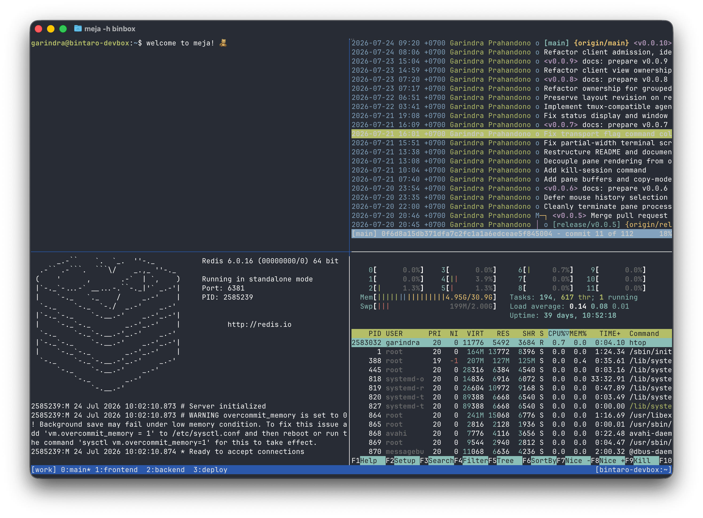

# meja

meja is a light tmux-style multiplexer with native remote capability and restorable & shareable sessions.



---

## One familiar workflow, local or remote

Start a new session on your machine by running:

```sh
meja
```

This starts a session with tmux-style windows and panes you know and love, and keybindings you're familiar with.

You can also start one on another machine:

```sh
meja -h user@host
```

`-h` also accepts aliases from your system’s SSH configuration:

```sh
meja -h devbox
```

If the network disappears, the client stays open. Meja preserves the last confirmed screen, shows that it is reconnecting, and continues when the connection returns.

Rename the session from inside it:

```sh
meja rename work
```

Detach from it:

```sh
meja detach
```

Meja keeps the session and its processes running. Return to it later:

```sh
meja attach -t work -h devbox
```

If the machine reboots—or the session otherwise ends—recover it from its latest recorded state:

```sh
meja restore -t work -h devbox
```

Meja creates and enters a new session with the saved windows, panes, directories, and prepared commands.


You can also run `save` to save the current session as a readable and editable `.meja` file:

```sh
meja save -t work -o dev.meja
```

Then create a fresh session from it:

```
meja new -f dev.meja
```

The file is readable and editable. Check it into version control so your team can recreate the same session on their machines.

---

## Installation

On Linux x86-64:

```sh
curl -fsSL https://github.com/garindra/meja/releases/download/v0.0.6/meja_0.0.6_linux_amd64.tar.gz \
  | sudo tar -xz -C /usr/local/bin meja
```

On macOS with Apple Silicon:

```sh
curl -fsSL https://github.com/garindra/meja/releases/download/v0.0.6/meja_0.0.6_darwin_arm64.tar.gz \
  | sudo tar -xz -C /usr/local/bin meja
```

You can also install the latest version with Go:

```sh
go install github.com/garindra/meja@latest
```

Check that your meja installation is successful:

```sh
meja version
```

For remote `meja -h <host>` sessions, make sure to also install the binary on the target machine, reachable on `$PATH`.


## Why `meja`

### Familiar by design

Meja follows tmux wherever practical.

It uses the same `Ctrl+b` prefix and the familiar model of sessions, windows, panes, splits, history, detaching, and attaching. Existing tmux knowledge transfers directly.

### Editable `.meja` files

`meja save` writes a live session's plan to a readable `.meja` file.

These files can be edited, kept with a project, checked into version control, and used by other people to create the same session arrangement.


### Named-session recovery

Meja persists the recoverable state of every named session.

After a reboot or ended session, `meja restore -t <session-name>` creates a new session from its latest recovery record. It preserves the session's windows, panes, layout, working directories, shells, commands, and active selection—not process memory or application state.

### The client survives disconnections

A dropped connection does not close the client or return you to the local shell.

Meja keeps the last confirmed terminal contents visible, displays its connection status, and reconnects automatically. Once connected again, it applies the latest layout and complete visible pane contents before normal input resumes.

### Latency compensation

Eligible keystrokes are applied optimistically on the client, keeping remote typing responsive while waiting for the server's render.

The server remains authoritative. Confirmed renders reconcile the local display with the actual terminal state.


## Command Bindings

As does `tmux`, `meja` uses `Ctrl+b` as its command prefix.

Press `Ctrl+b`, release it, and then press the command key.

Normal typing continues to go to the focused pane.

### Sessions and panes

| Keys                                                | Behavior                                                                |
| --------------------------------------------------- | ----------------------------------------------------------------------- |
| `Ctrl+b`, `d`                                       | Leave the session while keeping it and its processes running.           |
| `Ctrl+b`, `c`                                       | Create a new window.                                                    |
| `Ctrl+b`, `Space`                                   | Cycle through preset pane layouts.                                      |
| `Ctrl+b`, `%`                                       | Split the focused pane left/right.                                      |
| `Ctrl+b`, `"`                                       | Split the focused pane top/bottom.                                      |
| `Ctrl+b`, `↑` / `↓` / `←` / `→`                     | Focus the pane in that direction.                                       |
| `Ctrl+b`, `Ctrl+↑` / `Ctrl+↓` / `Ctrl+←` / `Ctrl+→` | Move a pane boundary by one row or column.                              |
| `Ctrl+b`, `Alt+↑` / `Alt+↓` / `Alt+←` / `Alt+→`     | Move a pane boundary by five rows or columns.                           |
| `Ctrl+b`, `z`                                       | Toggle the focused pane between its split position and the full window. |
| `Ctrl+b`, `{`                                       | Swap the focused pane with the previous pane.                           |
| `Ctrl+b`, `}`                                       | Swap the focused pane with the next pane.                               |
| `Ctrl+b`, `x`                                       | Ask for confirmation, then close the focused pane.                      |
| `Ctrl+b`, `:`                                       | Open the command prompt in the status bar.                              |
| `Ctrl+b`, `Ctrl+b`                                  | Send a literal `Ctrl+b` to the focused pane.                            |


### Windows

| Keys              | Behavior                                      |
| ----------------- | --------------------------------------------- |
| `Ctrl+b`, `n`     | Select the next window.                       |
| `Ctrl+b`, `p`     | Select the previous window.                   |
| `Ctrl+b`, `l`     | Return to the last selected window.           |
| `Ctrl+b`, `0`–`9` | Select the window with that status-bar index. |
| `Ctrl+b`, `,`     | Rename the current window.                    |
| `Ctrl+b`, `$`     | Name or rename the current session.           |

---

## Documentation

See [REFERENCE.md](REFERENCE.md) for the complete command, option, keybinding, profile, socket, autosave, and diagnostics reference.

See [ARCHITECTURE.md](ARCHITECTURE.md) for a detailed overview of Meja's internals, including the SSH bootstrap flow, QUIC transport layer, reconnection model, latency compensation strategy, rendering pipeline, session lifecycle, persistence format, protocol design, and security considerations.
